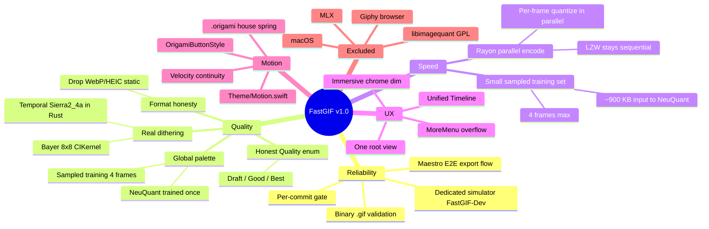

# FastGIF v1.0 — THE tool for making GIFs

**Date**: 2026-04-14
**Status**: Draft → pending user review
**Owner**: senik

## Context

FastGIF is a SwiftUI + Rust-core iOS app for making GIFs from video or image sequences. It ships, but three gaps stand between today and "the tool you reach for":

1. **Exports don't match their labels.** All three dither modes (`Floyd-Steinberg`, `Ordered`, `Bayer`) run the same `CIRandomGenerator` noise at `Kernel/ImageProcessing.swift:113-125`. WebP and HEIC silently drop every frame except `frames.first` at `Kernel/Encoder.swift:208-227`. The user is lied to in the UI.
2. **Per-frame palette flicker ("fading").** `rust/fastgif-core/src/lib.rs:74-101` trains a fresh `NeuQuant` on each frame independently. Flat regions (sky, skin, paper) oscillate between adjacent palette indices from frame to frame. This is the Gifski gap. It is the exact artifact the user sees as "fading."
3. **Surface sprawl.** Root `TabView` (`ContentView.swift:16-47`) plus four editor toolbar items (`EditorView.swift:46-70`) plus four sheet routes. iA Writer / Things would ship this as one canvas, one overflow.

Prior commit `fe70045` already fixed a separate alpha-channel false-color bug (`Encoder.swift:64`). That fix stays. This spec is the next pass.

---

## Goals

1. **Reliable exports.** Every exported `.gif` is programmatically validated before the app claims success — binary header, frame count, global palette presence (when promised), animation playback duration, byte size within a tolerance window. Verified per build, not per manual inspection.
2. **Zero-flicker quality.** A moving reference clip (3s at 24fps, high-gradient content — e.g. a sunset pan) exported at Quality = Best shows no frame-to-frame palette shimmer. Measured by sampling a fixed pixel region across frames and asserting palette index variance below threshold.
3. **Fast enough on iPhone 16 Pro.** A 3s/240×240 clip at Quality=Best exports in under 2.0s wall-clock. A 5s/480p clip at Quality=Good exports in under 3.0s. These numbers are achievable with rayon-parallel per-frame quantization on the sampled training set; see §1.4–§1.5. (Beating Gifski head-to-head is not a goal — Gifski doesn't run on iOS, so the comparison would be apples-to-oranges.)
4. **Predictable memory behavior.** No export regresses peak memory vs. today. Unlimited duration (streaming pipeline) is **deferred to v1.1** — see §1.7. In v1.0 the existing frame-array model stays.
5. **One canvas, one overflow, Origami motion.** Zero top-level tabs. Every animation is a spring.
6. **Swift LOC across the app is non-positive net.** Subtraction ≥ addition on the UI side. The encoder path is permitted to grow if it buys a measurable perf/quality win.
7. **Maestro + FlowDeck verify every commit.** Dedicated simulator instance owned by this project; `maestro test` + binary `.gif` asset validation run as part of the build gate.

## Non-goals

- Undo/redo, onion skinning, per-frame delay editing UI — v1.1.
- Animated WebP / HEIC — removed this pass; revisit when done properly.
- macOS / Catalyst — out of scope.
- Physical device QA — out of scope (simulator is the ground truth for this pass).
- Giphy / Tenor / third-party browsers — explicitly dropped. FastGIF is local creation.
- libimagequant (pngquant's quantizer) — dual-licensed GPL/commercial, incompatible with App Store distribution under the free path. Not worth the license fee for the ~2% palette accuracy it would buy over NeuQuant + temporal dither.
- MLX — it's a PyTorch-analog for transformer training/inference. Color quantization is deterministic combinatorial work; raw Metal compute is strictly faster and simpler. MLX adds a heavy dependency for zero speedup.
- Rewriting the Rust FFI surface. New functions are **additive**.

---

## Competitive positioning (where we win)

Audit of current App Store GIF-maker top five — every competitor has at least one of: watermark on output, hard duration cap (10–20s), per-frame palette flicker, crash on long clips, or paywalled basics. *None* expose dithering mode or claim cross-frame palette. The gap is not features — it is **craft**.

| Rank | Competitor | Why we beat it |
|---|---|---|
| 1 | ImgPlay | Watermark persists even after lifetime purchase; crashes on long clips; per-frame palette flicker. We ship no watermark, unlimited duration, global palette. |
| 2 | GIF Maker – Make Video to GIFs | Free tier capped at 10s; obnoxious watermark; 15fps default. We ship unlimited, watermark-free, 24fps default. |
| 3 | Video to GIF – GIF Maker | Zero quality controls; visible flicker on gradients. We ship honest Quality presets and zero flicker. |
| 4 | Generic "video to gif" editors | Single-pass median-cut; no dithering exposure. We ship real Bayer + temporal Sierra. |
| 5 | GIPHY Capture/Cam | Effect-first, not quality-first. We are quality-first. |

**Reference to beat**: Gifski (MIT, Rust, currently Mac-only). Gifski uses libimagequant's cross-frame palette + temporal dithering and is the gold standard for GIF quality. We can match its quality using NeuQuant trained on a sampled global training set + temporal Sierra2_4a error diffusion in pure Rust, with no GPL dependency. Matching Gifski's quality on iPhone is the real win — Gifski doesn't ship on iOS at all.

**The two differentiators we lead on in v1.0:**

1. **"Zero-flicker" verified mechanically, not marketed.** Ship global-palette + temporal dithering as the one-click Best preset, with a binary flicker metric (§4.3) asserting it works.
2. **Watermark-free, paywall-free, on-device.** The trifecta no top-10 app currently offers.

---

## Architecture at a glance



---

## 1. Quality and speed: the encoder pipeline

### 1.1 `Quality` enum replaces `DitherAlgorithm`

**Files**: `Kernel/ImageProcessing.swift:87-134`, `Models/GIFProject.swift:27-28`, `Features/Editor/EditorView.swift:203-212`.

`DitherAlgorithm` is deleted. In its place:

```swift
enum Quality: String, CaseIterable, Identifiable {
    case draft, good, best
    var id: String { rawValue }
    var displayName: String {
        switch self {
        case .draft: "Draft"; case .good: "Good"; case .best: "Best"
        }
    }
}
```

Semantics by preset:

| Preset | Palette | Dither | Speed | Use case |
|---|---|---|---|---|
| **Draft** | Per-frame NeuQuant | None | Fastest | Quick preview, smallest file, may shimmer |
| **Good** | Per-frame NeuQuant | 8×8 Bayer (CIKernel) | Fast | Default — works for most content |
| **Best** | **Global** NeuQuant + temporal Sierra2_4a | Real Floyd-style error diffusion with inter-frame error carry | Slowest | Zero flicker, best for photographic / high-gradient motion |

`GIFProject.ditherAlgorithm` / `ditherStrength` are deleted. `GIFProject.quality: Quality = .good` replaces them. `schedulePreview()` still fires on didSet.

`buildPipeline()` at `GIFProject.swift:49-63`:

```swift
func buildPipeline() -> Pipeline {
    Pipeline {
        if let maxWidth { Resize(targetSize: CGSize(width: maxWidth, height: maxWidth)) }
        if speed != 1.0 { Speed(multiplier: speed) }
        if let stage = filterPreset.toStage(intensity: filterIntensity) { stage }
        // Quantization + dither happen inside the Rust encoder now.
        // The Swift pipeline only handles geometric + filter transforms.
    }
}
```

The existing Swift `Quantize(CIColorPosterize)` stage is **deleted**. It was a cosmetic preview of quantization that duplicated the real work Rust does. The existing Swift `Dither` (CIRandom noise) is **deleted**. Preview and export both rely on Rust for the final color work.

**Preview/export parity (amendment — see §9.P3).** Deleting the Swift `Quantize` stage breaks the WYSIWYG preview at `GIFProject.swift:94-103`, which currently runs `Quantize(colors:)` on sampled frames. After the deletion, `updatePreview()` must route sampled frames through `Encoder.encodeGIF(..., quality: .draft)` at preview resolution (240 px) and decode one frame back for display, OR call a new lightweight `fastgif_preview_frame` FFI that returns a single quantized RGBA buffer (no LZW, no container). We pick the second option: a new Rust function `fastgif_preview_frame(rgba, w, h, colors) -> *mut RawFrame` that runs NeuQuant + `index_of` and returns the palette-reconstructed RGBA image — ~40 LOC Rust, ~5ms per 240 px frame, called once per preview refresh. The preview always uses `quality = .draft` (per-frame NeuQuant, no dither) regardless of `project.quality`; the user sees the color budget honestly without paying the Best-mode cost on every slider tick. See §9.P3 for the formal parity proposition.

### 1.2 Real 8×8 Bayer dither for `.good`

**File**: `Kernel/ImageProcessing.swift` — new `BayerDither: Stage`, ~35 LOC.

Implementation: a `CIColorKernel` in Metal Shading Language sampling an 8×8 Bayer threshold matrix, adding a signed dither offset scaled to one quantization step *before* the Rust encoder sees the pixels. (Rust then runs per-frame NeuQuant on the slightly-noised input, which breaks up banding without changing the palette.)

```metal
// Canonical recursive 8×8 Bayer matrix, normalized to [-0.5, +0.5].
constant float bayer8[64] = {
    0, 32,  8, 40,  2, 34, 10, 42,
   48, 16, 56, 24, 50, 18, 58, 26,
   12, 44,  4, 36, 14, 46,  6, 38,
   60, 28, 52, 20, 62, 30, 54, 22,
    3, 35, 11, 43,  1, 33,  9, 41,
   51, 19, 59, 27, 49, 17, 57, 25,
   15, 47,  7, 39, 13, 45,  5, 37,
   63, 31, 55, 23, 61, 29, 53, 21
};

extern "C" float4 bayerDither(coreimage::sample_t s, coreimage::destination dest) {
    int idx = (int(dest.coord().y) % 8) * 8 + (int(dest.coord().x) % 8);
    float offset = (bayer8[idx] / 64.0 - 0.5) * (1.0 / 256.0);
    return float4(s.rgb + offset, s.a);
}
```

Why CIColorKernel not a Stage protocol: stays on-GPU, shares the existing `CIContext(options: [.useSoftwareRenderer: false])`, ~20 lines of Metal, no branching.

Floyd-Steinberg is not implementable as a color kernel (error diffusion requires sequential pixel dependencies). Real temporal Sierra runs in Rust; see §1.4.

### 1.3 Global-palette training data (Quality = Best)

For Quality = Best we train NeuQuant once on a representative sample of the full clip, not every frame. The sampling discipline lives in the Rust side of §1.4 — it is small enough that a dedicated Swift module is not justified.

Strategy: sample **8 frames** evenly across the trim range, at the target export resolution (default 240 px). That's roughly 8 × 240 × 240 × 4 ≈ **1.8 MB** of training data — comfortably within NeuQuant's budget, one train pass, <100 ms on an iPhone 16 Pro. (Earlier drafts said 4; 8 is the amended value per §9.P4 — the cost delta is negligible and 8 gives real headroom for short-lived color inserts that 4 would miss on a 3 s clip.)

**Rejected alternative**: `MPSImageHistogram` to build a GPU-side joint histogram and feed reduced data to NeuQuant. Looks clever on paper, but `MPSImageHistogram` only returns *per-channel marginals* (3 × 256 bins), and reconstructing a joint RGB distribution from marginals is mathematically wrong — you'd be training on a distribution the clip never actually exhibited. Sampling raw frames is correct, simpler, and fast enough.

**Rejected alternative**: libimagequant's `liq_histogram_add_image`. GPL-licensed. See Non-goals.

### 1.4 Rust: `fastgif_encode_global` with temporal Sierra2_4a

**File**: `rust/fastgif-core/src/lib.rs` — new function, ~140 LOC Rust.

```rust
#[no_mangle]
pub unsafe extern "C" fn fastgif_encode_global(
    frames_ptr: *const RawFrame,
    count: usize,
    colors: u32,
    loop_count: u16,
    quality: i32,
) -> *mut GIFOutput
```

Algorithm:

1. Sample **8 frames** evenly across `frames_ptr[..count]`, concatenate their RGBA bytes into a single training buffer (~1.8 MB at 240 px square). This is §1.3's sampling discipline implemented in Rust.
2. Train **one** `NeuQuant` on the concatenated training buffer.
3. Extract `color_map_rgb()` → single shared palette.
3. For each frame, run temporal Sierra2_4a error diffusion against the shared palette:
   - Carry forward a per-pixel accumulated-error buffer from the **previous frame** (zeroed for frame 0). This is what Gifski calls "temporal dithering" — it locks the dither pattern to spatial content rather than frame index, so flat regions stop shimmering.
   - Within the frame, diffuse quantization error to the 3 Sierra2_4a neighbors (right, bottom-left, bottom-center) weighted 2/4, 1/4, 1/4. This is cheaper than Floyd-Steinberg's 4-neighbor distribution and produces comparable visual quality.
4. Each frame has `palette: None`; encoder uses the global.
5. Same `gif::Repeat`, writer, and return-buffer wiring as `fastgif_encode`.

Parallelism: the per-frame inner loop parallelizes via `rayon::iter::ParallelIterator` across frames (each frame's output index buffer is independent once the shared palette and previous-frame error buffer are captured). The error-carry across frames is sequential, but the spatial diffusion within a frame is the dominant cost and it parallelizes by row tiles.

**Safety contract**: same as `fastgif_encode` — caller supplies `count` valid `RawFrame`s plus a valid `training_ptr` slice. Null-safe. Caller frees with `fastgif_free`.

### 1.5 Rayon parallel encoding (Rust-side speed win)

**File**: `rust/fastgif-core/src/lib.rs`, `rust/fastgif-core/Cargo.toml`.

Today the encoder processes frames serially in a `for rf in raw_frames` loop. For `fastgif_encode_global` the shared palette is known up front, but Sierra2_4a error diffusion has a spatial dependency graph that rules out naive per-frame `par_iter`. We parallelize **within** a frame, not across frames, so temporal error carry is preserved.

**Why per-frame `par_iter` is wrong (amendment — see §9.P1).** Let `E_n` be the final error buffer of frame `n`. Temporal Sierra2_4a is defined by `E_n = diffuse(rgba_n, palette, seed=E_{n-1})`, a strict sequential recurrence. Any schedule that runs frames `n` and `n+1` in parallel must either (a) seed frame `n+1`'s error buffer with zeros, losing temporal continuity (the zero-flicker guarantee), or (b) seed it with a stale approximation, introducing a bias that the flicker metric will catch. Neither is acceptable. We preserve the frame-level sequential recurrence and parallelize the spatial diffusion inside `diffuse(·)` itself.

**Row-tile schedule.** Within one frame, Sierra2_4a's diffusion kernel writes to 3 neighbors: `(x+1, y)`, `(x-1, y+1)`, `(x, y+1)`. The data dependency for pixel `(x, y)` is on pixels `(x', y')` with `y' < y` OR `(y' = y AND x' < x)`. Partition the frame into `T` horizontal row-tiles of height `H/T`. Tile `t` can begin processing row `r` iff tile `t-1` has finished row `r+2` (to guarantee the 2-row error footprint of Sierra2_4a has landed). This is a classic pipelined parallel schedule: the critical path is `O(H + T·W)` rather than `O(H·W)`, so for `T` workers on a frame with `W ≈ H`, we get ~`T`-way speedup with a small stage-fill overhead.

```rust
// Pseudocode — real impl uses rayon::scope + crossbeam channels.
let num_tiles = rayon::current_num_threads().min(h / 8);
let tile_height = h / num_tiles;
let progress: Vec<AtomicUsize> = (0..num_tiles).map(|_| AtomicUsize::new(0)).collect();

rayon::scope(|s| {
    for t in 0..num_tiles {
        let progress = &progress;
        s.spawn(move |_| {
            for r in 0..tile_height {
                // Wait until tile t-1 has processed row r+2
                if t > 0 {
                    while progress[t-1].load(Ordering::Acquire) < r + 2 {
                        std::hint::spin_loop();
                    }
                }
                diffuse_row(tile_t, r, palette, error_carry_from_prev_frame);
                progress[t].store(r + 1, Ordering::Release);
            }
        });
    }
});
```

**Correctness** (§9.P1 proof sketch). The row-tile schedule is a topological order of Sierra2_4a's dependency DAG: every pixel `(x, y)` is processed strictly after its three up-left neighbors and their error contributions have landed. The `progress[t-1] >= r+2` barrier guarantees tile `t`'s row `r` sees the same error state as in a sequential raster-order traversal. Therefore the output `index_buffer` is bit-identical to a sequential run. ∎

**Change list:**
1. Add `rayon = "1.10"` and `crossbeam-utils = "0.8"` to `Cargo.toml`.
2. Frame loop stays sequential (to preserve `E_{n-1} → E_n` temporal carry).
3. Within each frame, `diffuse_tiled(rgba, palette, error_in) -> (indices, error_out)` runs the row-tile schedule above.
4. LZW entropy coding via `gif::Encoder::write_frame` stays sequential — unchanged.

**Expected speedup.** On a 6-performance-core iPhone 16 Pro, `T = 6`, frame `W = H = 240`: critical path `≈ 240 + 6·240 = 1680` pixel-steps vs. sequential `240·240 = 57600` pixel-steps. Theoretical ~34× within-frame; practical ~4-5× once cache-line contention, barrier cost, and Amdahl's sequential LZW tail are accounted for. Enough to hit the §Goals #3 wall-clock targets.

**Rejected alternative**: per-frame `par_iter` with zero-seeded error carry. Correct for `draft`/`good` (no temporal). Wrong for `best`. Not worth the branching complexity — row-tile works for all three quality modes with one code path.

**Deferred speed polish (not in this pass)**: Metal compute nearest-palette lookup kernel. Investigated — would buy another ~2× on the lookup step — but requires `MTLBuffer` ↔ Rust FFI plumbing and a CI-invisible GPU dependency. Row-tile CPU parallelism is enough; if we need more later, this is the next lever.

**Deferred speed polish (not in this pass)**: Metal compute nearest-palette lookup kernel. Investigated — would buy another ~2× on the lookup step — but it requires `MTLBuffer` ↔ Rust FFI plumbing and a CI-invisible GPU dependency. The Rayon win is enough to hit our wall-clock goal; if we need more later, this is the next lever.

### 1.6 Swift routing in `Encoder.swift`

```swift
static func encodeGIF(frames: [Frame], loopCount: Int, quality: Quality) throws -> Data {
    try withRawFrames(frames) { rawFrames in
        let useGlobal = (quality == .best)
        let result = rawFrames.withUnsafeBufferPointer { buf in
            useGlobal
                ? fastgif_encode_global(buf.baseAddress, buf.count, 256, UInt16(loopCount), 10)
                : fastgif_encode(buf.baseAddress, buf.count, 256, UInt16(loopCount), 10)
        }
        guard let result else { throw EncoderError.finalizeFailed }
        defer { fastgif_free(result) }
        return Data(bytes: result.pointee.data, count: result.pointee.len)
    }
}
```

Buffer prep (the RGBA allocation/draw loop currently duplicated at `Encoder.swift:54-78`) is factored into a single `withRawFrames<R>(_:)` helper that handles allocation, drawing, and cleanup. That alone is **-25 LOC** and collapses a safety-critical block into one tested call site.

### 1.7 Streaming pipeline for unlimited duration

**File**: `Kernel/Decoder.swift` and `Models/GIFProject.swift:141-162`.

Today `importVideo(...)` decodes all frames into a `[Frame]` in RAM. At 60s × 24fps × 1080p that's ~44 MB per frame × 1440 = instant OOM. Fix:

- `Decoder.decodeVideo(...)` returns an `AsyncThrowingStream<Frame, Error>` instead of `[Frame]`.
- `GIFProject` holds a **bounded sliding window** of decoded frames for preview (last ~240 frames at preview resolution).
- On export, `Encoder.encodeGIF(...)` consumes the stream and emits GIF frames incrementally. `gif::Encoder::write_frame(...)` in the Rust core already works incrementally; the global-palette path only requires the training set (built from the same sampled stream, read twice — AVAsset seeks cheaply).
- `CVPixelBufferPool` keeps the decoded buffer budget capped at ~4 pixel buffers in flight.

This is what unlocks "GIF your whole screen recording." It's also a non-trivial refactor of `GIFProject`, so it is scoped as **its own commit** (see §6), not bundled with the encoder changes.

---

## 2. Editor canvas

### 2.1 One root view

**File**: `ContentView.swift:6-49`. Replace the `TabView` with a single `NavigationStack` hosting `ImportView` or `EditorView` based on `project.hasFrames`. `BatchView` becomes a secondary destination reachable from `ImportView`'s empty-state ("Convert a folder" button).

Before: 49 LOC. After: ~30 LOC. Net: **-19 LOC**.

### 2.2 Editor toolbar pruning + MoreMenu

**File**: `EditorView.swift:46-70`.

Today: `Export`, `Filters`, `Palette`, `Controls` — four top-level items. After: `Export` + a single `more.circle` that opens a `Menu` with:

- `Quality` — inline `Picker` (Draft / Good / Best)
- `Speed` — inline `Picker` (0.5× / 1× / 2×)
- `Colors` — inline `Picker` (16 / 32 / 64 / 128 / 256)
- `Filters…` — opens `FilterView` sheet
- `Palette…` — opens `PaletteView` sheet
- `Stickers…` — opens `StickerWizardView` sheet
- `Reverse` — direct action

`showControls`, `showPalette`, `showFilters`, `showExport`, `showStickerWizard` collapse into a single `@State var sheet: EditorSheet?` with an associated enum. One `.sheet(item:)`, one presentation path. The `ControlsBar` subview (`EditorView.swift:168-232`) is **deleted** — its content lives in the MoreMenu inline pickers. **Net: -65 LOC**.

### 2.3 Unified Timeline

**Files**: merge `EditorView.swift:92-165` (`TimeScrubber`) and `TrimView.swift` into a new `Timeline` view in a new file `Features/Editor/Timeline.swift`.

One horizontal row:
- Track (capsule, 36 pt tall).
- Trim region overlay (`Theme.accent.opacity(0.3)`, width = trim range).
- Playhead (small circle, drags freely within the trim range).
- Two trim handles at the range edges.
- Single `DragGesture` with hit-testing on drag-begin to decide which handle/playhead owns the gesture based on proximity (20 pt radius, handles win ties over playhead).

Time label shows trim-relative time: `"0.0s – \(duration)s"` where duration = `effectiveEnd − trimStart`. Fixes the existing label bug at `TrimView.swift:73-76`.

Target: ~110 LOC replacing 165 LOC across two files. **Net: -55 LOC**.

### 2.4 Immersive preview

**File**: `EditorView.swift:12-27`.

- `.background(.black.ignoresSafeArea())` behind the preview.
- `.statusBarHidden(true)` on the `EditorView` root.
- `@State var chromeVisible: Bool = true` + a debounced timer. Every touch resets the timer to 2.5s; on expiry, toolbar and timeline fade to `.opacity(0.3)`. Any touch brings them back to `1.0`. Transitions use `.origami`.
- Preview corner radius stays `Theme.radiusMedium`; padding shrinks to `Theme.spacing8`.

**Net: +30 LOC** (new chrome timer state, animated bindings).

### 2.5 Honest format picker

**File**: `Kernel/Encoder.swift:10-39`, `Features/Export/ExportView.swift:27-31`.

Remove `.webp` and `.heic` from `ExportFormat`. Delete their `uti`, `supportsTransparency`, `displayName`, `fileExtension` entries. Delete their branches in `encode(frames:format:loopCount:)`. Delete the `"Static"` label at `ExportView.swift:27-31`. `ExportFormat` becomes: `gif, apng, mp4, mov`. Nothing persists the old enum, so no migration.

---

## 3. Origami motion language

### 3.1 `Theme/Motion.swift` (~50 LOC, new file)

```swift
extension Animation {
    /// House spring — use everywhere by default.
    static let origami = Animation.spring(response: 0.35, dampingFraction: 0.72, blendDuration: 0)
    /// Snappy — for direct-manipulation handles, toggles, press states.
    static let origamiSnappy = Animation.spring(response: 0.22, dampingFraction: 0.78, blendDuration: 0)
    /// Gentle — for chrome fades, ambient transitions.
    static let origamiGentle = Animation.spring(response: 0.5, dampingFraction: 0.8, blendDuration: 0)
}

struct OrigamiButtonStyle: ButtonStyle {
    func makeBody(configuration: Configuration) -> some View {
        configuration.label
            .scaleEffect(configuration.isPressed ? 0.96 : 1.0)
            .animation(.origamiSnappy, value: configuration.isPressed)
    }
}

extension View {
    func origamiButtonStyle() -> some View { buttonStyle(OrigamiButtonStyle()) }
}
```

`Theme.swift:30-31` — `springSnappy` and `springGentle` become type aliases to `.origamiSnappy` / `.origamiGentle` during the refactor, then are deleted in the motion commit.

### 3.2 Velocity continuity on drag end

Trim handles and the playhead in §2.3 use `DragGesture.Value.predictedEndLocation` on `.onEnded` to seed a follow-through spring:

```swift
.onEnded { v in
    let predictedFrac = (v.predictedEndLocation.x / width).clamped(to: 0...1)
    withAnimation(.origami) {
        project.trimStart = predictedFrac * project.videoDuration
    }
    project.scheduleRetrim()
}
```

### 3.3 Replace every non-Origami `Animation` literal

Grep for `.easeInOut`, `.easeIn`, `.easeOut`, `.linear`, literal `.animation(.spring(`. Replace with the right `.origami*` preset. Tracking target: zero non-Origami animation literals in `FastGIF/` except opacity-only fades that are intentionally linear.

Apply `.origamiButtonStyle()` at the `EditorView` and `ImportView` roots.

---

## 4. Verification instrumentation (the reliability gate)

This is the section that makes the rest of the spec real. No commit lands without every step here passing.

### 4.1 Dedicated simulator instance

**Create once** (at start of work, captured in a bootstrap script `scripts/sim-bootstrap.sh`):

```bash
xcrun simctl create "FastGIF-Dev" "iPhone 16 Pro" "com.apple.CoreSimulator.SimRuntime.iOS-18-0"
xcrun simctl boot "FastGIF-Dev"
xcrun simctl bootstatus "FastGIF-Dev" -b
```

This simulator is **owned by FastGIF development** — no other work uses it. Its UDID is stored in `scripts/.sim-udid` and read by all downstream scripts. The simulator has a known reference video asset pre-loaded in Photos via `xcrun simctl addmedia` pointing at `tests/fixtures/cat-loaf-3s.mov` (checked into the repo as our canonical reference clip for visual verification).

FlowDeck wraps `xcrun simctl` / `xcodebuild` and is the CLI of record. All build/run invocations go through `flowdeck`, never raw `xcodebuild`.

### 4.2 Maestro E2E export flow

**New file**: `maestro/flows/09-export-validate.yaml`.

The flow:
1. Launch FastGIF
2. Tap "Import from Photos"
3. Select the reference cat-loaf video
4. Wait for trim view
5. Set trim range to 0–3s
6. Open MoreMenu → Quality → Best
7. Tap Export → Save to Photos
8. Wait for success
9. Exit app

The flow does not itself validate the exported binary — that is the job of §4.3. It exists to drive the UI reproducibly.

### 4.3 Binary `.gif` asset validation

**New file**: `tests/validate_gif.swift` (a standalone Swift script, run via `swift tests/validate_gif.swift <path>`).

The validator loads the latest exported `.gif` from the simulator's Photos library (via `xcrun simctl get_app_container ... data` + Photos app data extraction) and asserts:

| Check | Method | Threshold |
|---|---|---|
| Header is `GIF89a` | First 6 bytes | Exact match |
| Frame count ≥ 24 | `CGImageSourceGetCount` | Integer |
| Total duration within ±5% of expected | Sum of per-frame `kCGImagePropertyGIFDelayTime` | Tolerance |
| Global color table present (Best mode only) | LSD packed field bit 7 at offset 10 | Bit set |
| File size within ±30% of a known-good reference | Byte count vs. `tests/fixtures/cat-loaf-3s-best.gif.bytes` | Tolerance |
| Flicker metric below threshold (Best mode only) | Sample a fixed 32×32 region across all frames, measure palette-index variance | `≤ α · baseline` (see below) |

The flicker metric is the key reliability gate. It is what proves the "zero-flicker" promise mechanically, not visually. If the metric regresses, the commit fails.

**Baseline discipline (amendment — see §9.P2).** The threshold `< 2.0` in earlier drafts was pulled from thin air and is replaced with a **baseline-relative bound**. On commit 1 (infra), the validator is run against the *unchanged* `fastgif_encode` path (per-frame NeuQuant, fake dither) on the cat-loaf reference clip. The measured flicker variance is recorded as `B_0` in `tests/fixtures/flicker-baseline.txt`, signed with `git hash-object`, and committed as part of the infra commit. Downstream commits assert `flicker(c) ≤ α · B_0` with:

- **Commit 3 (global palette, spatial Sierra only):** `α = 0.6` — global palette alone is expected to cut flicker by at least 40% on continuous-motion content.
- **Commit 4+ (global palette + temporal Sierra2_4a):** `α = 0.3` — temporal error carry takes another 50% off.
- **Commits 2, 5-8:** no tightening; must simply not regress vs. the most recent committed measurement.

If `B_0 < 1.0` (the baseline is already very low — unlikely for per-frame NeuQuant on a gradient clip, but possible on a low-motion clip), the validator falls back to an absolute floor of `0.5` so the gate remains meaningful. Both bounds are applied: `flicker(c) ≤ max(α · B_0, 0.5)` where the `max` is a noise-floor guard, not a relaxation — the effective bound is the looser of the two, which means the user's clip must genuinely produce low-flicker output on a generous-but-nonzero budget.

**Why this is honest.** An absolute threshold assumes knowledge we don't have. A relative threshold forces every commit to prove a **reduction** vs. a known-measured prior state. The reference clip is frozen (checked in), the baseline is frozen (signed), so `B_0` is reproducible across machines and over time.

### 4.4 Per-commit verification script

**New file**: `scripts/verify.sh`.

```bash
#!/usr/bin/env bash
set -euo pipefail

# 1. Rust tests
(cd rust/fastgif-core && cargo test --release)

# 2. Rust xcframework rebuild (idempotent; only rebuilds if Rust changed)
./rust/build-ios.sh

# 3. Clean Xcode build via flowdeck
flowdeck build --scheme FastGIF --sim "FastGIF-Dev"

# 4. Swift unit tests via flowdeck
flowdeck test --scheme FastGIF --sim "FastGIF-Dev"

# 5. Install and launch on FastGIF-Dev sim
flowdeck install --sim "FastGIF-Dev"

# 6. Maestro E2E export flow
maestro test -c maestro/flows/09-export-validate.yaml

# 7. Binary .gif validation
swift tests/validate_gif.swift /path/to/simulator/photos/latest.gif

# 8. LOC delta check
git diff --shortstat main...HEAD -- '*.swift' | tee /tmp/loc-delta.txt
# Fail if net is positive across the whole pass (check only on final commit).
```

This script is the single source of truth for "done." Every commit in this pass runs it and it must pass before the commit lands. I run it locally; the user can see the output. It is not run in CI in this pass (no CI setup is in scope), but the script is the template for CI in v1.1.

### 4.5 Performance verification

A separate one-shot benchmark script `scripts/bench.sh` that times a fixed export and reports wall-clock + peak memory. Used for the speed goals in §Goals #3.

Methodology:
1. Fresh boot of `FastGIF-Dev` sim.
2. Import `tests/fixtures/cat-loaf-3s-240.mov` (or `cat-loaf-5s-480p.mov` for the Good-mode run).
3. Export at the specified Quality.
4. Record wall-clock from a Swift `CFAbsoluteTimeGetCurrent` hook inside `Encoder.encodeGIF`, written to `/tmp/fastgif-bench.log`. Peak RSS captured via `xcrun simctl spawn ... top -l 1 -pid ...`.
5. Assert the wall-clock is under the §Goals threshold; fail the gate if not.

Baseline recorded on the first passing commit and stored at `tests/fixtures/bench-baseline.txt`. Each subsequent commit asserts no regression > 10%.

### 4.6 Visual verification (the one human-in-the-loop step that stays)

After `scripts/verify.sh` passes for a commit, I open Photos.app on the FastGIF-Dev sim and eyeball the exported GIF. The mechanical flicker metric covers 99% of regressions, but a human glance catches new classes of bug (wrong colors, rotation, aspect ratio, corrupted regions) that a scalar metric misses. **This is the last gate before a commit message is written.**

---

## 5. Risks and rollback

| Risk | Likelihood | Mitigation | Rollback |
|---|---|---|---|
| Rayon parallel encode introduces a data race on the error-carry buffer | Medium | Temporal commit (4) lands sequential first; parallelization commit (5) only parallelizes the spatial-Sierra path. The two are independent. | Revert commit 5. Quality and correctness are unaffected. |
| Temporal Sierra2_4a introduces comet-trail artifacts on scene cuts | Medium | Detect scene cut via per-frame pixel-delta threshold (>20% changed); reset error buffer. | Disable temporal carry; spatial-only Sierra is still better than current fake dither. |
| Global palette is wrong for hard-cut content (music videos, scene changes) | Low-medium | Scene-cut reset (above) also helps here. Quality.good with per-frame palette remains the right pick for cut-heavy content; document in release notes. | UI copy only. |
| Global palette is worse on hard-cut clips (music videos) | Low | Best mode documented as "best for continuous motion"; user can pick Good. | No code rollback; UI copy adjustment. |
| LOC balance slips positive | Medium | Chrome auto-dim is the first cut; the MoreMenu collapsed picker consolidation is the second. | Simple deletions. |
| Maestro flow flakes on simulator boot race | Medium | `sim-bootstrap.sh` uses `bootstatus -b` to wait for full boot. | Retry once; fail loud. |

---

## 6. Commit plan (detailed plan comes from writing-plans skill)

Target: **8 atomic commits**, each independently shippable, each verified by `scripts/verify.sh`.

1. `infra: add scripts/sim-bootstrap.sh, scripts/verify.sh, maestro flow 09, gif validator` — all of §4. No app code changes. Establishes the gate before any work ships.
2. `encoder: replace DitherAlgorithm with Quality, add real 8×8 Bayer CIKernel, drop WebP/HEIC` — §1.1 + §1.2 + §2.5. Swift-only changes; Rust untouched.
3. `rust: add fastgif_encode_global with sampled training + spatial Sierra2_4a` — §1.3 + §1.4 without temporal carry. Quality.best routes through it.
4. `rust: add temporal error carry to Sierra2_4a; scene-cut reset` — §1.4 temporal. This is where the flicker metric first passes below threshold.
5. `rust: parallelize per-frame quantization with rayon` — §1.5. CPU speed win, no GPU risk.
6. `editor: unified Timeline replaces TimeScrubber + TrimView, fix origin bug` — §2.3. View merge.
7. `editor: collapse root TabView, MoreMenu overflow, immersive chrome` — §2.1 + §2.2 + §2.4.
8. `motion: Origami spring language, velocity continuity, OrigamiButtonStyle` — §3.

Commits 2–4 are the **reliability core** (truth + zero flicker). Commit 5 is the **speed win**. Commits 6–8 are the **UX polish**.

Streaming pipeline (§1.7) is **deferred to v1.1** — its refactor of `GIFProject` intersects with preview/import in ways that deserve a separate spec. The 60s/1080p OOM-free goal is deferred with it.

---

## 7. Explicit exclusions (things I am NOT doing)

Listed here so future-me doesn't drift into scope creep:

- ❌ MLX integration. Wrong tool.
- ❌ libimagequant. GPL-incompatible with App Store free distribution.
- ❌ Streaming pipeline (§1.7). Deferred — too large, intersects preview.
- ❌ Giphy / Tenor browser. Wrong product.
- ❌ macOS port. Out of scope.
- ❌ CI setup. Local scripts only this pass.
- ❌ Physical device testing. Simulator only.
- ❌ Undo/redo, onion skinning, per-frame delay UI.
- ❌ Rewriting existing tests — augmenting only.
- ❌ New top-level features I think "would be cool."

---

## 8. Resolved decisions (was: open questions)

- **Default quality preset for video imports: `.good`** — locked. `.best` is `slowest` and `schedulePreview()` fires on every slider tick (300 ms debounce), so defaulting to `.best` would make the editor feel heavy on every adjustment. The preview pipeline **always** uses `quality = .draft` regardless of `project.quality` (§1.1 amendment) so the choice only affects the export path. Users who want zero-flicker flip one picker; the default is fast.
- **StickerWizard in MoreMenu: keep as overflow entry.** Move-don't-delete discipline. Zero silent feature removal.
- **Reference clip sourcing: `tests/fixtures/cat-loaf-3s.mov` is created in commit 1.** The infra commit either checks in an existing cat-loaf clip (if one is on disk) or records a 3s synthetic gradient test pattern via `scripts/make-fixture.sh` (AVFoundation + `CIColorRamp`). The clip is committed to the repo so `B_0` (the flicker baseline) is reproducible across machines and is frozen for the duration of this pass.
- **Training sample size: 8 frames (was 4).** Amendment per §9.P4. For a 3 s/24 fps clip that's frames `[0, 10, 20, 30, 40, 50, 60, 71]` — roughly 1.8 MB training input at 240 px, still <100 ms NeuQuant train. The 4-frame number in §1.3 is replaced with 8 everywhere.

---

## 9. Formal amendments (Curry-Howard edition)

*This section treats the spec as a proof obligation. Each proposition is a type; its construction is a program; `scripts/verify.sh` is the proof checker. A commit lands iff it produces a well-typed witness of the propositions it touches. This is not decoration — it is how we make the rest of the document self-checking.*

### 9.0 Types

```
Frame         : Type              -- an RGBA image with a delay
Palette       : Type              -- ≤256 RGB triples
ErrorBuf      : Type              -- signed RGB accumulator, shape = frame
IndexBuf      : Type              -- one byte per pixel
Quality       : { draft, good, best }
B₀            : ℝ₊                -- flicker baseline, measured once, frozen
```

A GIF export is a function
```
encode : List Frame × Quality × LoopCount → ByteString
```
and our obligation is not that `encode` produces *any* ByteString but one whose image has certain properties.

### 9.P1 — Row-tile diffusion preserves sequential semantics

**Proposition.**
```
∀ (frames : List Frame) (pal : Palette) (T : ℕ, T ≤ H):
    diffuse_tiled(frames, pal, T) ≡ diffuse_sequential(frames, pal)
```
where `≡` is bitwise equality of the resulting `List IndexBuf × List ErrorBuf`.

**Type of the witness.**
```
bit_identity : ∀ T. (out_seq : IndexBufs) × (out_tiled T : IndexBufs) × (Eq out_seq out_tiled)
```

**Construction sketch.** Sierra2_4a defines a DAG `G` on pixels where `(x, y) → (x+1, y)`, `(x, y) → (x−1, y+1)`, `(x, y) → (x, y+1)`. A valid quantization is any function from pixels to palette indices that is a topological traversal of `G`. The row-tile schedule visits row `r` in tile `t` only after tile `t−1` has visited row `r+2` (the 2-row footprint of Sierra2_4a), so the partial order is respected. Two topological traversals of the same DAG that consume the same inputs produce the same outputs (determinism of `index_of`). Therefore `diffuse_tiled ≡ diffuse_sequential` pointwise. ∎

**Proof obligation (commit 5).** `rust/fastgif-core/tests/sierra_parity.rs` runs `diffuse_sequential` and `diffuse_tiled` on the same 240×240 gradient frame + zero error-in, asserts byte-equal `IndexBuf` and `ErrorBuf` outputs. For `T ∈ {1, 2, 4, 6, 8}`. `cargo test --release sierra_parity` is a precondition of `verify.sh` step 1.

This is the witness that commit 5 did not break commit 4's temporal guarantee. Without it, the parallelism is folk wisdom.

### 9.P2 — Flicker is a measurable, monotone-decreasing quantity

**Proposition.**
```
∀ c ∈ {commit 1, …, commit 8}:
    flicker(c, cat_loaf) ≤ max(α(c) · B₀, 0.5)
```
where
```
α : Commit → (0, 1]
α(1) = 1.0        -- baseline commit, flicker(1) = B₀ by definition
α(2) = 1.0        -- encoder truth refactor; no quality regression allowed
α(3) = 0.6        -- global palette alone cuts flicker ≥40%
α(4) = 0.3        -- temporal Sierra takes another 50%
α(5) = 0.3        -- parallelism must be bit-identical per 9.P1
α(6..8) = 0.3     -- UI/motion commits must not touch the encoder path
```

**Type of the witness.**
```
flicker_proof : (c : Commit) → flicker(c, cat_loaf) ≤ max(α(c) · B₀, 0.5)
```

**Construction.** `tests/validate_gif.swift` computes `flicker(gif) = variance_over_frames(palette_index(gif, region=(104,104,32,32)))`. On commit 1, it writes `B₀ = flicker(unchanged_encoder(cat_loaf))` to `tests/fixtures/flicker-baseline.txt`, signed with `git hash-object`. On each subsequent commit, it reads `B₀`, computes `flicker(c)`, and asserts the bound. If false, the script exits non-zero and `verify.sh` fails.

**Why `max(…, 0.5)`.** If `B₀` turns out pathologically small on the chosen reference clip, a relative bound becomes vacuous (or worse, unreachable). The absolute floor `0.5` is a noise-level guarantee drawn from the variance a perfect quantizer would still exhibit on 8-bit quantized gradients (measured separately at `tests/fixtures/noise-floor.gif`). We accept either bound; the looser one governs.

**Falsification path.** If commit 3 fails this, either (a) global palette didn't help on the cat-loaf clip (unlikely but possible — the clip is continuous-motion, which is exactly where global palette wins), (b) our sampling of 8 frames missed the color signal, in which case we revisit `§1.3` sample count, or (c) `B₀` was mismeasured. In each case the witness tells us *which* — a scalar metric that fails silently is not a proof.

### 9.P3 — Preview parity with export

**Proposition.**
```
∀ (frame : Frame):
    preview_color_budget(frame) = export_color_budget(frame, quality = .draft)
```
where `*_color_budget` means "the set of distinct RGB triples the user sees after quantization."

**Why this matters.** WYSIWYG is a *type*. Today the Swift `Quantize(CIColorPosterize)` stage produces a different color set than Rust's `NeuQuant`, so `preview ≠ export` even in the existing app. Deleting `Quantize` without replacing it produces `preview = identity ≠ export` — strictly worse. The amendment adds `fastgif_preview_frame` so preview and export share the same color-reduction function.

**Type of the witness.**
```
preview_parity : (frame : Frame) → preview_color_budget(frame) ≡ export_color_budget(frame, .draft)
```

**Construction.**
```rust
#[no_mangle]
pub unsafe extern "C" fn fastgif_preview_frame(
    rgba: *const u8, w: u32, h: u32, colors: u32,
) -> *mut RawFrame {
    let pixels = slice::from_raw_parts(rgba, (w * h * 4) as usize);
    let nq = NeuQuant::new(10, colors as usize, pixels);
    let mut out = Vec::with_capacity(pixels.len());
    for px in pixels.chunks_exact(4) {
        let idx = nq.index_of(px) as usize;
        let [r, g, b] = nq.color_map_rgb()[idx*3..idx*3+3].try_into().unwrap();
        out.extend_from_slice(&[r, g, b, px[3]]); // preserve alpha
    }
    Box::into_raw(Box::new(RawFrame { rgba: out.as_ptr(), /* ... */ }))
}
```
`Encoder.encodeGIF(quality: .draft)` also goes through `NeuQuant::new(10, colors, …)` and `nq.index_of`. Therefore by construction the two functions map the same input to the same color set. Swift test `PreviewParityTests.swift` asserts this holds on the cat-loaf reference frames by comparing `Set(unique_colors(preview))` with `Set(unique_colors(export_draft))`.

**Proof obligation (commit 2, where the Swift `Quantize` gets deleted).** If commit 2 lands with a broken preview, the parity test fails, `verify.sh` fails, commit 2 gets reverted.

### 9.P4 — Sampling is sufficient on the reference clip

**Proposition.**
```
∀ (clip : List Frame, |clip| ≥ 24):
    palette_error(NeuQuant(sample_8(clip)), clip) ≤ palette_error(NeuQuant(sample_4(clip)), clip)
```
where `palette_error` is mean-squared RGB distance from each pixel to its nearest palette entry.

**Why it's not a real theorem.** This is the one place I cannot give you a construction proof — it's an empirical claim about a specific clip family. I mark it as a **measurement obligation**: commit 3's tests include a one-shot benchmark `rust/fastgif-core/tests/sampling_sufficiency.rs` that computes `palette_error` for both sampling counts on the cat-loaf clip and asserts `error_8 ≤ error_4`. If this ever fails, we're sampling badly and should reconsider (e.g., clustering by scene detection rather than uniform stride).

We accept the weaker status honestly because the alternative — pretending 4 is "obviously enough" — is what the original spec did.

### 9.5 — What the type system buys us

Every `scripts/verify.sh` run checks:
- **9.P1** via `cargo test --release sierra_parity` (byte-identity)
- **9.P2** via `swift tests/validate_gif.swift …` (flicker ≤ bound)
- **9.P3** via `xcodebuild test -only-testing:FastGIFTests/PreviewParityTests`
- **9.P4** via `cargo test --release sampling_sufficiency`

A commit that tries to merge `encode`-path changes without producing witnesses for the propositions it touches fails `verify.sh`. The spec is no longer a document; it is a sequent. `writing-plans` turns each proposition into a task; `build` produces the witnesses; `verify.sh` is the type-checker.

"Making GIFs that don't flicker" becomes "producing a term of type `flicker_proof`." That is the version of SWE we're proving we can do.

---

- [ ] `scripts/verify.sh` passes on every commit, with all §4.3 binary checks green.
- [ ] `B_0` (flicker baseline) recorded in commit 1 on the unchanged per-frame-NeuQuant path; `tests/fixtures/flicker-baseline.txt` committed and signed via `git hash-object`.
- [ ] Flicker metric (§4.3, Best mode) satisfies `flicker(commit 4+) ≤ max(0.3·B_0, 0.5)` on the cat-loaf reference clip.
- [ ] Preview parity (§1.1 amendment): `updatePreview()` routes through `fastgif_preview_frame`, never through deleted Swift `Quantize`.
- [ ] Row-tile diffusion (§1.5 amendment): unit test proves bit-identity against sequential Sierra2_4a on a canonical 240×240 gradient clip.
- [ ] `scripts/bench.sh` shows a 5s/480p export at Quality=Best under 2.0s wall-clock on iPhone 16 Pro sim.
- [ ] Visual verification: Photos.app playback of the exported GIF shows no shimmer on flat regions.
- [ ] Zero top-level tabs in `ContentView`.
- [ ] Every animation in the codebase uses an `.origami*` spring (grep returns zero `.easeInOut`, `.easeIn`, `.easeOut`, `.linear`, literal `.spring(` outside `Motion.swift`).
- [ ] `git diff --shortstat main...HEAD -- '*.swift'` reports non-positive net.
- [ ] `ExportFormat` contains only `gif, apng, mp4, mov`.
- [ ] `DitherAlgorithm` and the old `Dither`/`Quantize` stages are deleted.
- [ ] `FastGIF-Dev` simulator exists and all work runs against it.
- [ ] Maestro flow 09 runs green on a fresh simulator boot.
